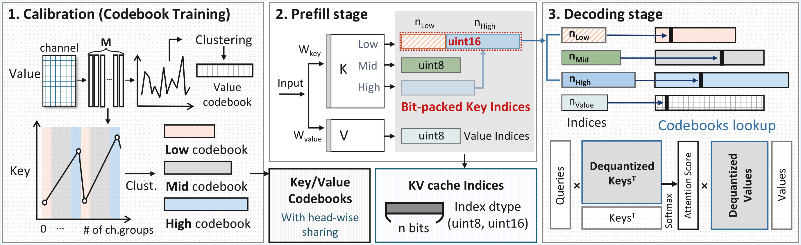

# MeltKV

## Memory-Aligned KV Cache Compression via Variable-Bit Packed Vector Quantization for Long-Context LLMs

ICCAD 2026 · Official implementation

> https://iccad.com/2026/authors/call-for-papers/n

> Built upon [MILLION](https://github.com/ZongwuWang/MILLION) (DAC'25).

## Overview

Long-context LLMs make KV caches dominate memory and latency. Existing vector quantization (VQ) methods compress KV caches to sub-4-bit levels, but often overlook memory alignment and decoding speed.

**MeltKV** is a memory–latency co-optimized KV cache quantization framework. It adaptively assigns bit-widths to grouped key channels and packs indices into standard data types (`uint8` / `uint16`), removing redundant bits. Head-wise codebook sharing further reduces codebook size while preserving accuracy.

At comparable perplexity, MeltKV achieves **48.1% lower memory** and **52.9% lower latency** than state-of-the-art VQ methods, while supporting compression down to **1 bit**.

<p align="center">
  
</p>

## Results

WikiText-2 perplexity on **LLaMA-3-8B** (context length 8192):

| Method | PPL ↓ |
|--------|------:|
| Baseline | 5.54 |
| MeltKV 2-bit | 6.09 |
| MeltKV 1-bit | 9.89 |

## Setup

```bash
conda create -n meltkv python=3.12
conda activate meltkv
pip install -r requirements.txt
```

Set the HuggingFace LLaMA path in `configs/llama-3.1-8b.json` (`folder`), and place evaluation datasets under `datasets/`.

### Codebooks

Shipped under `codebooks/`:

| File | Setting |
|------|---------|
| `llama3_2bit.pt` | `-M 32 --bit-setting 2bit` |
| `llama3_1bit.pt` | `-M 16 --bit-setting 1bit` |

Codebook training follows Coupled Quantization (CQ) [Zhang et al., 2024]. Training scripts will be released later.

## Usage

```bash
# MeltKV (2-bit)
python evaluate.py -f llama-3.1-8b.json -d wikitext-2-raw-v1 \
  -M 32 --nbits 8 --half --bit-setting 2bit -p evaluation

# MeltKV (1-bit)
python evaluate.py -f llama-3.1-8b.json -d wikitext-2-raw-v1 \
  -M 16 --nbits 8 --half --bit-setting 1bit -p evaluation

# Baseline (FP16)
python evaluate.py -f llama-3.1-8b.json -d wikitext-2-raw-v1 \
  --half -p baseline
```

> LongBench support is being cleaned up and will be added soon.

## Citation

```bibtex
@inproceedings{MeltKV26,
  title={MeltKV: Memory-Aligned KV Cache Compression via Variable-Bit Packed Vector Quantization for Long-Context LLMs},
  author={Jiyun Han, Seongjoon Cho and Seungkyu Choi},
  booktitle={ICCAD},
  year={2026}
}
```

## License

GPL-3.0 (see `LICENSE`), following MILLION.
